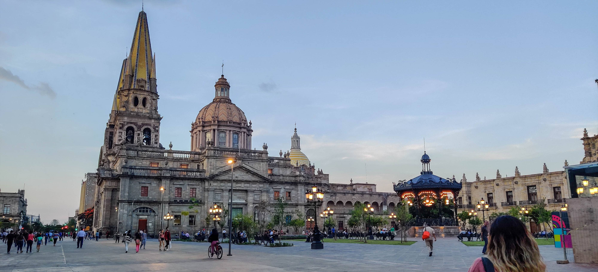

# Requiered
- npm ( <a href="https://www.npmjs.com" target="_blank">https://www.npmjs.com</a> )
- Gulp ( <a href="https://gulpjs.com" target="_blank">https://gulpjs.com</a> )

# Installation
```javascript
> npm install
```

*Note* The latest Node version tested is 12.22.5, if use a most recent version can receive a error, if need install a old version of node can use this:
```javascript
> nvm install 12.22.5
> nvm use 12.22.5
```


# Using
Just put all images to convert and compress in the folder <b>src</b>, run the command and have all the images in the folder images.

Optional, can run just a process, this script have 2, convert and compress, if just need just one run it some like this: <em>gulp convert</em> or <em>gulp compress</em>

<b>Important:</b> <em>gulp convert</em> get the images from folder <b>src</b> and <em>gulp compress</em> get the images from the folder <b>dest</b>

The command <em>gulp images</em> is a serie for convert and compress tasks

## Execute
```javascript
> gulp images
```
This execute the basic compress for imagen in folder <b>src</b>, send the images converters to folder <b>dest</b> and the final images with compress to the folder <b>images</b>.

| Params  | Default | Values  | Description |
| ------------- |-------------|-----|-----|
| output  | <em>empty</em> | <em>string</em> jpeg, png, tiff and webp | if is empty the output is same to original image |
| resize  | false | <em>boolean</em> true \| false | If need apply a resize |
| width   | 1000 | <em>Integer</em> | Apply this width to the output image |
| height  | 1000 | <em>Integer</em> | Apply this height to the output image |
| fit     | contain | cover, contain, fill, inside, outside | Indicate the resize method to apply in the image |
| bg      | #ffffffff | <em>string</em> | Indicate the background for resizes using the format #rrbbggaa |
| q       | 80 | <em>Integer</em> 0 to 100 | Indicate the quality where 100 is the best but files more bigs |

### example

Original images
<small>Size: 932kb</small>

<small>Size: 3.2mb</small>

---
```javascript
> gulp images
```
<small>Size: 495kb</small>

<small>Size: 1.1mb</small>

---
```javascript
> gulp images --resize --width 500 --height 400 --output png --fit cover
```
<small>Size: 98kb 500x400px</small>

<small>Size: 111kb 500x400px</small>

---
```javascript
> gulp images --output webp
```
<small>Size: 518kb</small>

<small>Size: 711kb</small>


### Using for a ecommerce like Shopify
Some ecommerce need images for a specific size (or optimized images), if need use this script for this can use this 
```javascript
> gulp images --resize --width 1000 --height 1000 --output jpg
```
This have a exit for all images to jpg, in a size 1000x1000px, and can put in the folder <b>src</b> subfolders and all images can be converter and compress

<small>All images are from Pixabay.com</small>
